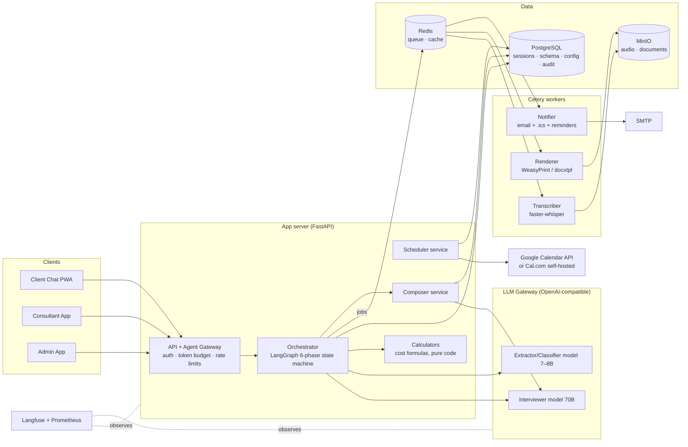
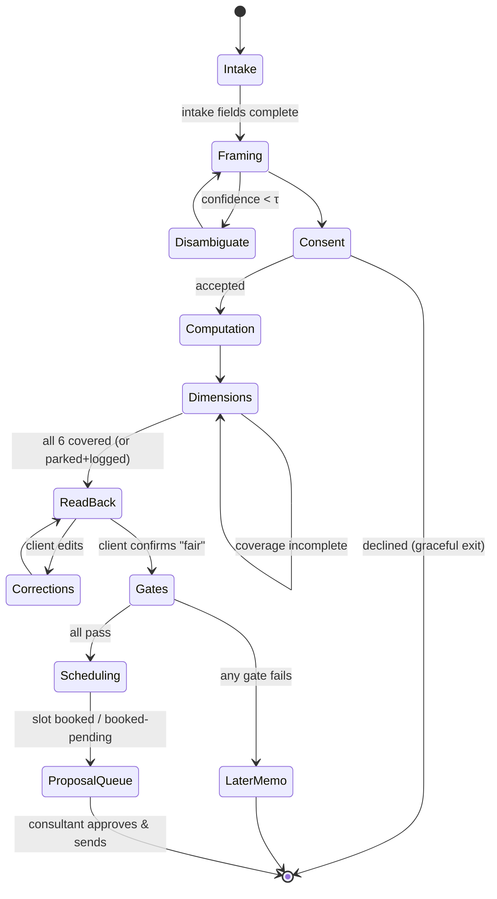

# Discovery Agent — Architecture & System Design

**Open-source-first system design for the six-phase discovery agent (PRD v1.0, User Stories v1.0)**

Version 1.0 · August 2026 · Status: Draft for engineering review

---

## 1. Design principles

1. **Deterministic scaffolding, LLM inside.** The six-phase protocol, dimension coverage, gates, arithmetic, scheduling, and composition checks are ordinary code. The LLM only phrases questions, picks follow-ups within a phase, extracts structure from answers, and drafts prose. This is an architectural property, not a prompt instruction.
2. **Open source first; free tier as fallback.** Every component below is OSS and self-hostable. Where a hosted free tier is meaningfully easier (LLM inference, email), it is listed as an explicit alternative with the trade-off stated. Free tiers change — verify current terms before committing.
3. **Boring infrastructure.** One Postgres, one Redis, one app container, one worker container, docker-compose up. No Kubernetes until the numbers demand it.
4. **Everything auditable.** Append-only event log of what the agent asked, asserted, computed, and sent. Any session reconstructable.
5. **Swappable models.** All LLM calls go through one internal gateway with an OpenAI-compatible interface, so open-weights models, local inference, and hosted APIs are interchangeable per sub-agent.

---

## 2. Stack summary

| Layer | Choice (OSS) | License | Why | Fallback / alternative |
|---|---|---|---|---|
| Frontend (client chat PWA) | **React + Vite + Tailwind** | MIT | Mobile-first chat UI, offline-tolerant PWA | Svelte/SvelteKit |
| Frontend (consultant/admin) | Same stack, separate app | MIT | Review queue, config CRUD | — |
| API backend | **Python + FastAPI** | MIT | Async, Pydantic schemas double as extraction schemas | Node + NestJS |
| Agent orchestration | **LangGraph** (langgraph, MIT) | MIT | Graph/state-machine model matches the six-phase protocol exactly; checkpointing = resumable sessions | Hand-rolled state machine + XState-style tables |
| LLM inference (self-hosted) | **vLLM** or **Ollama** serving open-weights models (Llama 3.3 70B / Qwen 2.5 72B for interviewer & composer; Llama 3.1 8B / Qwen 2.5 7B for extractor & classifier) | Apache-2.0 (servers); open-weight licenses per model | Truly free at the software level; full data control | Hosted free tiers (Groq, Google AI Studio) — fastest start, but rate limits and data-policy review required |
| Speech-to-text | **Whisper** via **faster-whisper** (large-v3; `tl` + `en` supported, handles code-switching acceptably) | MIT | Taglish voice messages, self-hosted, no per-minute cost | whisper.cpp on CPU for low volume |
| Database | **PostgreSQL 16** | PostgreSQL License | Sessions, schema store, config, audit log; JSONB for extracted findings | — |
| Queue / async jobs | **Redis + Celery** (or RQ) | BSD/MIT | Transcription jobs, doc rendering, reminders, webhooks | Postgres-backed queue (e.g. Procrastinate) to drop Redis |
| Object storage | **MinIO** (or plain disk for v0) | AGPL-3.0 | Voice files (pre-deletion), rendered PDFs/docx | Local filesystem |
| Scheduling | **Cal.com self-hosted** (AGPL) *or* direct **Google Calendar API** (free) + **ics** library | AGPL / free API | Cal.com gives free/busy, booking, reschedule, reminders out of the box; Google API path is lighter | CalDAV (Radicale) for fully self-hosted calendars |
| Email (invites, documents) | SMTP via **aiosmtplib** + any mailbox; self-hosted **Postal** if volume grows | MIT / MIT | .ics invites and proposal delivery are just email | Brevo/Resend free tiers |
| PDF rendering | **WeasyPrint** (Markdown → HTML → PDF) | BSD | Print-quality PDFs from HTML templates, pure OSS | Typst, Pandoc+LaTeX |
| DOCX rendering | **python-docx** / **docxtpl** | MIT | Consultant-editable exports | Pandoc |
| LLM observability | **Langfuse self-hosted** | MIT | Traces every prompt/response per session; evals for the test-persona suites | OpenTelemetry + Grafana only |
| Metrics/logs | **Prometheus + Grafana + Loki** | Apache-2.0/AGPL | G1–G7 dashboards, per-phase drop-off | — |
| Auth | Session cookies (client, anonymous); **Keycloak** or FastAPI-Users for consultant/admin | Apache-2.0/MIT | Clients need no accounts; staff need real auth | Authelia |
| Deployment | **Docker Compose** on one VM | — | v0/v1 scale is one box | Oracle Cloud Always Free ARM VM (4 OCPU/24 GB) is a known zero-cost host — verify current terms |

**The one honest cost caveat:** everything here is free software, but a self-hosted 70B-class model needs a GPU (rented ~US$0.4–1.5/hr, or owned). The zero-cash paths are: (a) small open models (7–8B) for all roles — acceptable for v0, weaker interviewer prose; (b) hosted free tiers within their rate limits; (c) CPU-only 7B via Ollama — slow but functional for the spike. The gateway design makes upgrading later a config change.

---

## 3. Component architecture



**Key boundary:** the LLM boxes have no arrows to Postgres, the calendar, or SMTP. Models return text/JSON to the orchestrator; only deterministic services touch state, calendars, and email (US-8.8, US-6.6).

---

## 4. The orchestrator — six phases as a LangGraph

The protocol compiles to a graph whose **nodes** are either deterministic (code) or generative (one constrained LLM call), and whose **edges** are guarded by code — the LLM never chooses an edge.



**Session state (LangGraph checkpointed to Postgres → resumability, US-3.7):**

```python
class SessionState(TypedDict):
    session_id: str
    lang_profile: dict          # detected EN/TL mix
    stated_problem: str          # verbatim, immutable
    problem_frame: ProblemFrame  # classes, confidence, sidedness,
                                 # private_individuals, pain_hypothesis
    consent: ConsentRecord
    figures: list[Figure]        # value, unit, range?, provenance, source_msg_id
    computation: CostResult | None   # produced by code, never LLM
    war_stories: list[WarStory]
    coverage: dict[Dimension, CoverageStatus]  # pending/active/covered/parked
    findings: list[Finding]      # six, drafted at ReadBack
    readback_confirmed: bool
    gates: GateResults | None
    booking: BookingState | None
    token_spend: TokenBudget
    phase: Phase
```

**Node types:**

| Node | Kind | Implementation |
|---|---|---|
| Intake, Consent | deterministic + template copy | fixed scripts, i18n variants |
| Framing | LLM (extractor model) → validated | classification into the 8-class taxonomy, Pydantic-validated JSON; threshold τ in config |
| Computation | **pure code** | formula registry keyed by problem class (§6); LLM only phrases the input questions and the one-sentence playback from a computed value |
| Dimensions loop | hybrid | code picks the next dimension (pain-hypothesis order, coverage tracker); interviewer LLM generates ONE question; extractor LLM structures the answer; code updates coverage |
| ReadBack | LLM drafts from schema only | composer prompt receives *only* `figures/findings/war_stories`, not raw transcript, so it cannot cite unextracted claims |
| Gates | pure code | four boolean evaluators over the schema |
| Scheduling | deterministic service | §8 |
| LaterMemo / ProposalQueue | composer service | §7 |

**Interviewer output contract (enforced, US-3.2/3.3):**

```json
{
  "reflection": "string, <= 140 chars, restates the client's last point, no advice",
  "question": "string, exactly one interrogative",
  "dimension": "value_economics | accountability | ...",
  "targets_field": "figures.hours_per_month | owner.name | ..."
}
```

Validation rejects multi-question output and regenerates (max 2 retries → fall back to the dimension's canonical question from the question bank). Every generation is traced in Langfuse.

---

## 5. Sub-agent design

| Sub-agent | Model class | Input | Output (validated) | Notes |
|---|---|---|---|---|
| **Framer** | small (7–8B) | intake text | `ProblemFrame` JSON | few-shot with the 10 test personas; τ tunable |
| **Interviewer** | large (70B) if available | dimension intent + question-bank patterns + last 6 turns + lang profile | reflection+question JSON | temperature ~0.7 for phrasing variety; canonical fallback guarantees progress on weak models |
| **Extractor** | small, JSON-mode | last client message + expected `targets_field` | `Figure[]`, `WarStory[]`, owner names, availability windows | ranges kept as ranges; provenance auto-set; **never performs arithmetic** |
| **Transcriber** | faster-whisper large-v3 | audio file | text + confidence + language tags | low confidence → one-tap correction UI (US-3.5); audio deleted post-transcription per retention config |
| **Composer** | large | schema slices + operator config blocks | Markdown per document section | §7 provenance checks run *after* composition |
| **Classifier** | pure code | schema | `GateResults` | not an LLM task at all |
| **Scheduler NL parser** | small | availability utterance | candidate windows JSON | slot math is code (§8) |

**Prompt-injection posture (US-10.1):** client messages enter prompts only inside a delimited `CLIENT_SAID` block; system prompts state that its content is data; a lightweight pre-filter flags instruction-like content ("ignore", "you are now", "discount") for logging; and the architecture is the real defense — even a fully "persuaded" interviewer can only emit a reflection+question JSON, because gates, prices, sends, and bookings are unreachable from any LLM output path.

---

## 6. Calculator registry (Phase 1)

Pure, unit-tested functions; the formula registry is operator-extensible (new problem-class packs register a formula + required inputs):

```python
@register("acquisition")
def acquisition_cost(hours: Range, hour_value: Money,
                     spend: Money, wins: Range) -> CostResult:
    monthly = hours * hour_value + spend
    return CostResult(
        cost_per_win = monthly / wins,        # Range arithmetic
        monthly_cost = monthly,
        anchors = {"cpw": ..., "ltv": ...},
        inputs_provenance = collect(hours, hour_value, spend, wins),
    )
```

Range arithmetic propagates uncertainty (₱40–60K, not false precision). `CostResult` is the **only** source the playback sentence and the proposal's numbers table may cite. An automated test asserts computed values equal hand-computed values for every test persona (US-2.2).

---

## 7. Composer pipeline and provenance gate

```
schema + config(version-pinned) 
   → section templates (Jinja2, fixed skeleton order)
   → LLM prose passes per section (input = schema slices ONLY)
   → ASSEMBLE draft.md
   → CHECK 1: number provenance — extract every numeric token from draft,
              diff against schema figures/CostResult (unit-normalized);
              orphan number ⇒ BLOCK + alert (US-6.6)
   → CHECK 2: proof blocks — every case-study section must carry a
              library_id present in the operator store (US-6.4)
   → CHECK 3: tree integrity — every filled-row cell maps to a schema
              field or catalog entry id (US-6.2)
   → consultant review queue (edit → re-render)
   → on approve: WeasyPrint → PDF, docxtpl → DOCX, store in MinIO,
                 email via Notifier
```

Checks are code, run on the final artifact, and blocking. The Later memo uses the same pipeline with a reduced skeleton.

---

## 8. Scheduling design (Phase 5)

Two supported backends behind one `SchedulerPort` interface:

**Option A — Google Calendar API (recommended for v1; free):** OAuth per consultant with **minimum scopes**: `calendar.freebusy` + `calendar.events` on one designated calendar (US-8.8). Flow: NL parser → candidate windows → `freebusy.query` → offer ≤3 slots → on confirm, create event with client as attendee (Google emails the invite) → store `event_id` for reschedule/cancel sync. Reminders: Celery beat T-24h via email (independent of calendar-native reminders).

**Option B — Cal.com self-hosted (fully OSS, AGPL):** the agent drives Cal.com's API (availability → slots → booking); Cal.com handles invites, reschedule links, and reminders natively. Heavier to run, less code to write; best when multi-consultant routing arrives (v1.5).

**Invariants (both options):** slot computation and calendar writes happen only in the deterministic scheduler service; concurrency-safe booking (row lock on consultant+slot, verified by the double-booking test, US-8.3); invite title `Reviewing: '<stated_problem>' — <Business> × <Operator>`; attendee copy names the human consultant; Phase 5 is unreachable in the graph before gates pass (US-8.7); no-overlap/timeout → `booked_pending` + consultant notification (US-8.6).

---

## 9. Data model (PostgreSQL)

```
sessions(id, started_at, phase, lang_profile, token_spend, status)
intake(session_id, business_name, business_desc, stated_problem TEXT /*verbatim*/,
       role, size_band, customer_type)
problem_frames(session_id, classes JSONB, confidence, sidedness BOOL,
       private_individuals BOOL, pain_hypothesis, version /*re-framing keeps history*/)
consents(session_id, text_version, accepted_at, ip_hash)
messages(id, session_id, sender ENUM(client,agent), text, audio_object_key NULL,
       transcript_confidence NULL, created_at)
figures(id, session_id, name, value_low, value_high, unit,
       provenance ENUM(user_stated, suggested_range, computed), source_msg_id)
war_stories(id, session_id, summary, consequence, priced_cost NULL, source_msg_id)
coverage(session_id, dimension, status ENUM(pending,active,covered,parked), q_count)
findings(session_id, dimension, text, confirmed BOOL, corrected_from NULL)
gate_results(session_id, g1..g4 BOOL, classification ENUM(now,later),
       failed_reason NULL, evaluated_at)
bookings(session_id, consultant_id, slot_start, slot_end, backend ENUM(gcal,calcom),
       external_event_id, status ENUM(offered,confirmed,booked_pending,
       rescheduled,cancelled))
documents(id, session_id, kind ENUM(proposal,later_memo), md_key, pdf_key, docx_key,
       config_version, checks JSONB, status ENUM(draft,approved,sent), approved_by)
-- operator config (all versioned, append-only versions)
service_catalog(id, version, problem_class, service_name, action_template)
pilot_templates(id, version, problem_class, scope_tpl, exit_criterion_tpl, timeline_tpl)
proof_library(id, version, title, body, class_tags, industry_tags, verified_by)
price_blocks(id, version, name, body)
trust_text(id, version, body)
-- audit
audit_log(id, session_id, actor, event_type, payload JSONB, created_at)  -- append-only
```

Deletion (US-10.5) cascades sessions→messages/figures/documents and purges MinIO objects; `audit_log` retains only event types + hashes where law requires, per retention policy.

---

## 10. Key sequence: one interview turn

```mermaid
sequenceDiagram
  participant C as Client PWA
  participant GW as Gateway
  participant O as Orchestrator
  participant W as Whisper worker
  participant X as Extractor LLM
  participant I as Interviewer LLM
  participant PG as Postgres

  C->>GW: voice message (audio)
  GW->>O: message event (budget checked)
  O->>W: transcribe job
  W-->>O: text + confidence
  alt low confidence
    O-->>C: "Did I get that right?" (one-tap fix)
  end
  O->>X: extract(targets_field, CLIENT_SAID)
  X-->>O: Figure[] / WarStory[] JSON (validated)
  O->>PG: persist figures, coverage++, audit
  O->>O: code: pick next dimension / or trigger calculator
  O->>I: generate(reflection+question, constraints)
  I-->>O: JSON (validated; retry→canonical fallback)
  O->>PG: audit(asked)
  O-->>C: reflection + one question
```

---

## 11. Security & privacy implementation

- **Transport/auth:** TLS everywhere; client sessions = signed httpOnly cookies (anonymous); consultant/admin behind Keycloak (OIDC) with role separation; admin config writes require re-auth.
- **Secrets:** environment-injected (SOPS/age-encrypted in repo for OSS-only setups).
- **Data minimization:** audio deleted post-transcription (configurable); no third-party analytics on the client PWA; no enrichment calls anywhere.
- **LLM data control:** self-hosted inference keeps transcripts on-box; if a hosted free tier is used instead, its data-retention terms must pass review first (flagged as a deployment decision, not a code change).
- **Compliance hooks:** consent versioning, deletion workflow, RA 10173 records of processing; per-jurisdiction consent text via config.
- **Injection defense in depth:** delimited data blocks + pre-filter logging + the structural fact that LLM outputs cannot reach gates, prices, calendars, or email (§5).

---

## 12. Deployment

**v0/v1 topology — one VM, docker-compose:**

```yaml
services:
  web:        # FastAPI + orchestrator
  worker:     # Celery: transcribe, render, notify, reminders(beat)
  llm:        # ollama or vllm (or omitted if using a hosted free tier)
  whisper:    # faster-whisper server
  postgres:
  redis:
  minio:
  langfuse:
  grafana:    # + prometheus, loki
  calcom:     # optional, only if Option B scheduling
```

Sizing: everything except `llm` runs comfortably in 4 vCPU / 8–16 GB (fits the Oracle Always Free ARM shape). `llm`: 7–8B quantized needs ~8 GB (CPU-tolerable for v0); 70B needs a rented GPU or a hosted free tier. Backups: nightly `pg_dump` + MinIO mirror to a second free-tier object store. Scale path (post-v1): split worker pool, read replica, then—and only then—container orchestration.

---

## 13. Cost profile

| Path | Software cost | Infra cash cost | Trade-off |
|---|---|---|---|
| All-OSS, small models, free ARM VM | ₱0 | ~₱0 (Oracle Always Free — verify terms) | Weakest interviewer prose; fine for v0 spike |
| All-OSS + rented GPU for 70B | ₱0 | ~US$0.4–1.5/hr while testing (can be started/stopped) | Best quality, full data control |
| OSS stack + hosted LLM free tier | ₱0 | ₱0 within rate limits | Fastest start; rate limits; external data-policy review required |

Per-session marginal cost in all paths ≈ electricity/GPU-minutes; there are no per-seat or per-message licenses anywhere in the stack.

---

## 14. Alternatives considered

| Decision | Chosen | Rejected | Why |
|---|---|---|---|
| Orchestration | LangGraph | LangChain agents / AutoGen free-form | The PRD demands a state machine the LLM cannot steer; free-form agent loops violate the core principle |
| Extraction | Small LLM + Pydantic validation | Regex/rules only | Taglish, ranges, and war stories are too varied for rules; validation catches LLM drift |
| Arithmetic | Code registry | LLM math | Non-negotiable per PRD (hallucinated math) |
| STT | Whisper large-v3 | Cloud STT APIs | Cost, privacy, Taglish adequacy; correction UI covers residual errors |
| Scheduling | Google API (A) / Cal.com (B) | Building slot logic + invites fully in-house | Booking edge cases (DST, reschedule, double-book) are a solved OSS problem |
| PDF | WeasyPrint | Headless Chromium print | Lighter, deterministic, pure-Python pipeline |
| DB | Postgres only | Postgres + vector DB | No retrieval need in v1; proof matching is tag-based; add pgvector later if semantic matching is wanted |

---

## 15. Traceability

- §4 graph ⇔ PRD §4 phases; guards implement US-3.1, US-4.3, US-8.7.
- §6 calculators ⇔ PRD Phase 1 + US-2.2/2.3.
- §7 checks ⇔ US-6.2/6.4/6.6; review queue ⇔ US-7.1–7.5.
- §8 ⇔ PRD Phase 5 + Epic 8 (incl. US-8.3 concurrency, US-8.8 scopes).
- §11 ⇔ Epic 10 + PRD §8.
- Langfuse eval suites host the test personas required by US-1.4, US-3.9, and the G6 generality test.
