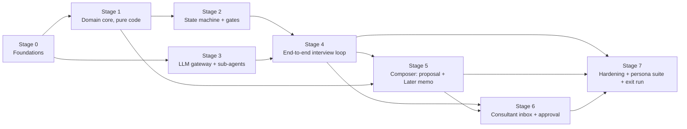

# v0 Internal Spike — Build-Order Plan

> **For agentic workers:** This is the master sequencing plan for the v0 milestone. Each stage below gets its own detailed implementation plan (TDD, task-by-task) when picked up — use `superpowers:writing-plans` to write it and `superpowers:subagent-driven-development` or `superpowers:executing-plans` to execute it. Stages use checkbox (`- [ ]`) syntax for tracking.

**Goal:** Ship the v0 internal spike — a text-only, end-to-end discovery session (intake → framing → computation → six dimensions → read-back → gates → Markdown proposal into a consultant inbox) for 4 problem classes, passing the PRD §9 exit criterion.

**Architecture:** Deterministic six-phase LangGraph state machine with the LLM confined to phrasing, extraction, and prose (PRD §1.2, Architecture §1). One FastAPI app + Postgres + Redis via docker-compose; all LLM calls behind one OpenAI-compatible gateway so models are swappable per sub-agent.

**Tech Stack:** Python 3.12 + FastAPI + Pydantic · LangGraph · PostgreSQL 16 · Redis (defer Celery until a real async job exists) · minimal React/Vite chat page (plain text) · Langfuse (or plain OTel logging for v0) · Docker Compose.

**Spec:** [PRD v1.0](../discovery-agent-prd-v1.0.md) (§4 protocol, §5 proposal, §9 v0 scope, §11 acceptance) · [User Stories v1.0](../discovery-agent-user-stories.md) (all P0 stories) · [Architecture v1.0](../discovery-agent-architecture.md)

**Tracking:** GitHub milestone [v0 — Internal spike](https://github.com/ryan-smartwave/discovery-agent/milestone/1) — 33 P0 issues. Guardrail (⚠) issues are release-blocking.

## Global Constraints

Copied from the PRD; every stage implicitly includes these.

- **The LLM never controls phase transitions, gates, arithmetic, prices, sends, or bookings** — deterministic code only (PRD §1.2, Architecture §1.1).
- **All arithmetic executed in code, never by the LLM** (PRD §4 Phase 1, US-2.2 / [#20](https://github.com/ryan-smartwave/discovery-agent/issues/20)).
- **v0 scope is exactly:** text-only chat; 4 problem classes — *acquisition, throughput, quality, supply*; coded calculators for those four; Markdown proposal into a consultant inbox; **no client-facing send** (PRD §9).
- `stated_problem` is stored **verbatim and immutable**, echoed in the read-back, printed on the proposal cover (PRD §4 Phase 0).
- AI disclosure in the first message and the proposal footer; consent before Phase 1; both non-skippable (US-1.2 / [#12](https://github.com/ryan-smartwave/discovery-agent/issues/12), US-1.8 / [#18](https://github.com/ryan-smartwave/discovery-agent/issues/18)).
- No product names, prices, or pitches in Phases 0–3 (US-3.8 / [#31](https://github.com/ryan-smartwave/discovery-agent/issues/31)).
- Every figure carries a provenance flag (`user_stated` / `suggested_range` / `computed`); ranges stored as ranges (US-2.3 / [#21](https://github.com/ryan-smartwave/discovery-agent/issues/21)).
- Append-only audit log from day one — retrofitting auditability is not possible (US-10.4 / [#67](https://github.com/ryan-smartwave/discovery-agent/issues/67)).
- Client messages enter prompts only inside delimited `CLIENT_SAID` blocks (Architecture §5).

## Ordering rationale

1. **Walking skeleton first, quality second.** The PRD's top risk is "does an AI interview produce sellable findings?" — that is only testable end-to-end. So the spine (Stages 0–3) reaches a complete session as fast as possible with canned-quality prose, then Stages 4–6 raise output quality.
2. **Pure code before LLM.** Calculators, schema, state machine, and gates are deterministic and unit-testable with zero model dependency — they are also the scaffolding every LLM call is constrained by. Building them first means LLM work lands inside working guardrails, not the reverse.
3. **Guardrails are load-bearing infrastructure, not a final coat.** Audit log, provenance, injection posture, and hard gates are built into the layer they belong to, in the stage that layer is built. Stage 7 only *verifies* them.
4. **UI last and minimal.** PRD §9 allows a consultant *inbox* instead of a review UI; the client chat needs only text in/out. Nothing in the spike is blocked on frontend polish.

## Dependency graph

Stages 1–2 and Stage 3 are independent after Stage 0 — **two people (or two worktrees) can run them in parallel.**

---

### - [ ] Stage 0 — Foundations (days 1–2)

**Issues:** [#67](https://github.com/ryan-smartwave/discovery-agent/issues/67) US-10.4 audit trail (infrastructure half) · groundwork for [#11](https://github.com/ryan-smartwave/discovery-agent/issues/11), [#68](https://github.com/ryan-smartwave/discovery-agent/issues/68)

**Deliverables:**
- Repo scaffold: `app/` (FastAPI), `tests/`, `docker-compose.yml` with `web`, `postgres`, `redis`; CI running `pytest` + `ruff` on push.
- Postgres schema v1 via migrations (Architecture §9): `sessions`, `intake`, `messages`, `figures`, `war_stories`, `coverage`, `findings`, `gate_results`, `documents`, `audit_log`, `consents`, `problem_frames`.
- `audit_log` as **append-only** (no UPDATE/DELETE grants; trigger-enforced) with a `record_event()` helper every later component must call.
- Anonymous session issuance: `POST /sessions` → signed httpOnly cookie + resumable session ID (the transport half of US-1.1).
- Deletion cascade skeleton (`DELETE /sessions/{id}`) wired to the schema's FK cascades — the full US-10.5 flow lands in Stage 7, but cascades must exist before data accumulates.

**Exit criteria:** `docker compose up` gives a healthy API; migrations apply from zero; an integration test writes a session + audit events and proves audit rows cannot be updated or deleted.

### - [ ] Stage 1 — Domain core, pure code (days 2–4)

**Issues:** [#20](https://github.com/ryan-smartwave/discovery-agent/issues/20) US-2.2 calculators · [#21](https://github.com/ryan-smartwave/discovery-agent/issues/21) US-2.3 ranges + provenance · [#22](https://github.com/ryan-smartwave/discovery-agent/issues/22) US-2.4 playback (template half)

**Deliverables:**
- `Range` value type with range arithmetic (`Range * Money`, `Range / Range`) propagating uncertainty; `Figure` model with provenance enum and `source_msg_id`.
- Calculator registry (`@register("acquisition")` …) for the four v0 classes — acquisition, throughput, quality, supply — each returning `CostResult` with `monthly_cost`, anchors, and `inputs_provenance` (Architecture §6).
- Per-class required-inputs manifest (which fields the interview must collect before the calculator can fire).
- One-sentence playback template per class rendering from `CostResult` only (currency/units from session).
- Unit tests: computed values equal hand-computed values for every v0 test persona (the US-2.2 AC, verbatim).

**Exit criteria:** all calculator tests green; a property test proves no calculator path accepts LLM-provided arithmetic (calculators take typed `Figure`s only).

### - [ ] Stage 2 — State machine and gates (days 3–6, parallel with Stage 3)

**Issues:** [#24](https://github.com/ryan-smartwave/discovery-agent/issues/24) US-3.1 coverage · [#36](https://github.com/ryan-smartwave/discovery-agent/issues/36) US-4.3 ⚠ read-back gate · [#37](https://github.com/ryan-smartwave/discovery-agent/issues/37) US-5.1 four gates · [#57](https://github.com/ryan-smartwave/discovery-agent/issues/57) US-8.7 ⚠ Phase-5 unreachable

**Deliverables:**
- LangGraph graph per Architecture §4: Intake → Framing → (Disambiguate) → Consent → Computation → Dimensions loop → ReadBack ⇄ Corrections → Gates → LaterMemo | Handoff, checkpointed to Postgres. All edges guarded by code.
- Coverage tracker: 2–3 questions per dimension, pain-hypothesis ordering, `pending/active/covered/parked` states; ReadBack unreachable while any dimension is uncovered and unparked.
- Read-back gate: `readback_confirmed` flips only on explicit client confirmation; Gates node unreachable without it; confirmation audited.
- Gate evaluator: G1 number-exists, G2 owner-pain, G3 core-problem, G4 reachable as four pure boolean functions over `SessionState`; result + failed reason persisted; thresholds in config.
- Post-gates node is `Handoff` (v0 has no scheduler): emits the "a human takes it from here" message and stops. Structural test proving no path reaches Handoff without all gates passing (US-8.7's v0 form).

**Exit criteria:** graph-level tests drive a fake session through every path (confirm, correct-then-confirm, decline, each gate failing individually) using stubbed LLM nodes; no test can reach ReadBack with uncovered dimensions or Handoff with a failed gate.

### - [ ] Stage 3 — LLM gateway and sub-agents (days 3–7, parallel with Stage 2)

**Issues:** [#14](https://github.com/ryan-smartwave/discovery-agent/issues/14) US-1.4 framer · [#15](https://github.com/ryan-smartwave/discovery-agent/issues/15) US-1.5 one disambiguation · [#25](https://github.com/ryan-smartwave/discovery-agent/issues/25) US-3.2 one question · [#26](https://github.com/ryan-smartwave/discovery-agent/issues/26) US-3.3 reflections · [#64](https://github.com/ryan-smartwave/discovery-agent/issues/64) US-10.1 injection posture · [#65](https://github.com/ryan-smartwave/discovery-agent/issues/65) US-10.2 scope deferrals

**Deliverables:**
- LLM gateway: one OpenAI-compatible client, per-sub-agent model config, retries, token accounting per session, every call traced (Langfuse or structured logs).
- **Framer:** intake text → `ProblemFrame` JSON (Pydantic-validated; 4 v0 classes + `other`→graceful "not yet supported" copy); confidence threshold τ in config; below τ → exactly one disambiguation question then re-frame (never more than one).
- **Extractor:** `CLIENT_SAID`-delimited input + `targets_field` → validated `Figure[]` / owner names / free-text findings; ranges preserved; provenance auto-set to `user_stated` or `suggested_range`; **no arithmetic**.
- **Interviewer:** dimension intent + question bank + last turns → `{reflection ≤140 chars, question: exactly one interrogative, dimension, targets_field}`; validator rejects multi-question output, regenerates max 2×, then falls back to the dimension's canonical bank question.
- Question bank: canonical questions per dimension per v0 class (the guaranteed-progress floor).
- Injection/scope posture: system prompts declare client content data-only; pre-filter flags instruction-like content ("ignore", "discount", "you are now") and legal/financial/tax questions → canned deferral copy + audit log entry.

**Exit criteria:** framer classifies the v0 persona set (≥10 personas, 4 classes) correctly; interviewer contract tests pass 50 consecutive generations with zero multi-question outputs reaching the caller; injection test cases produce refusal + log, never behavior change.

### - [ ] Stage 4 — End-to-end interview loop (days 7–10)

**Issues:** [#11](https://github.com/ryan-smartwave/discovery-agent/issues/11) US-1.1 · [#12](https://github.com/ryan-smartwave/discovery-agent/issues/12) US-1.2 ⚠ disclosure · [#13](https://github.com/ryan-smartwave/discovery-agent/issues/13) US-1.3 intake · [#18](https://github.com/ryan-smartwave/discovery-agent/issues/18) US-1.8 ⚠ consent · [#19](https://github.com/ryan-smartwave/discovery-agent/issues/19) US-2.1 opener · [#22](https://github.com/ryan-smartwave/discovery-agent/issues/22) US-2.4 playback (wired) · [#31](https://github.com/ryan-smartwave/discovery-agent/issues/31) US-3.8 ⚠ no pitching · [#34](https://github.com/ryan-smartwave/discovery-agent/issues/34) US-4.1 read-back · [#35](https://github.com/ryan-smartwave/discovery-agent/issues/35) US-4.2 corrections · [#51](https://github.com/ryan-smartwave/discovery-agent/issues/51) US-8.1 ⚠ handoff copy

**Deliverables:** wire Stages 1–3 together behind a chat API + minimal web chat page (mobile browser, no login — US-1.1's UX half):
- Scripted intake: AI disclosure first message → business → `stated_problem` (verbatim) → role/customers/size (skippable) → consent (accept proceeds, decline exits gracefully, both audited).
- Phase 1 conversation: class opener ("what does this cost you?"), "I don't know" → guided input collection per the Stage-1 manifest → calculator fires → one-sentence playback → value-anchor attempt.
- Dimensions loop live: extractor → coverage → interviewer, one question per message with reflection.
- Read-back: findings composed **from schema fields only** (composer prompt never sees raw transcript), opens with verbatim `stated_problem` echo, per-finding correction updates schema with audit trail, "Fair summary?" gate.
- Deflection line for "what do you sell?"; transcript linter (CI) greps sessions for price/product/pitch patterns in Phases 0–3.
- Gates run; pass → US-8.1 handoff copy naming the (configured) human consultant.

**Exit criteria:** one real person completes a full session in the browser against a real model for each of the 4 classes; every number in the read-back traces to a `Figure` row; transcript linter green. **This is the walking skeleton — the "can this sell?" review starts here.**

### - [ ] Stage 5 — Composer: proposal and Later memo (days 10–13)

**Issues:** [#40](https://github.com/ryan-smartwave/discovery-agent/issues/40) US-6.1 skeleton · [#41](https://github.com/ryan-smartwave/discovery-agent/issues/41) US-6.2 value tree · [#43](https://github.com/ryan-smartwave/discovery-agent/issues/43) US-6.4 ⚠ proof matching · [#45](https://github.com/ryan-smartwave/discovery-agent/issues/45) US-6.6 ⚠ number provenance · [#38](https://github.com/ryan-smartwave/discovery-agent/issues/38) US-5.2 ⚠ Later memo

**Deliverables:**
- Minimal operator config (seed files/tables, not an admin UI — that's Epic 9, P1): service catalog for 4 classes, a small verified proof library, trust text, pilot templates.
- Composer pipeline (Architecture §7): Jinja2 skeleton in fixed order (cover w/ verbatim problem → findings → numbers table w/ provenance → value tree → how-we-work → proof → pilot → appendix); LLM prose passes receive schema slices only; output Markdown (PDF/docx are v1).
- Value tree builder: one filled row (financial line = Phase-1 `CostResult`, driver = exposed mechanism, action = catalog entry, owner = accountability finding) + 1–2 sketched rows; every filled cell carries a machine-readable source ref.
- **Blocking checks, code, on the final artifact:** (1) every numeric token diffs against schema figures/`CostResult`, orphan → block + alert; (2) every proof block carries a `library_id` present in the store, else fallback/omit; (3) every tree cell maps to schema field or catalog ID.
- Later memo via the same pipeline, reduced skeleton: findings + failed gate + reason + "start tracking this" + **no scheduling push** (assert in test).

**Exit criteria:** golden-file tests per class; adversarial test where the LLM pass is forced to emit an invented number/case study and both checks block; AI-disclosure footer present in every artifact.

### - [ ] Stage 6 — Consultant inbox and approval (days 12–15)

**Issues:** [#46](https://github.com/ryan-smartwave/discovery-agent/issues/46) US-7.1 notification · [#47](https://github.com/ryan-smartwave/discovery-agent/issues/47) US-7.2 review · [#48](https://github.com/ryan-smartwave/discovery-agent/issues/48) US-7.3 edit · [#49](https://github.com/ryan-smartwave/discovery-agent/issues/49) US-7.4 ⚠ approval

**Deliverables (PRD §9 allows an inbox, not a full UI):**
- On session completion: email/webhook to the consultant within 1 minute with the four essentials (business, class, Now/Later, — slot n/a in v0) + link.
- One authenticated page (basic auth acceptable for v0) listing sessions with transcript, findings, figures + provenance, gate results, skipped questions, and the draft Markdown.
- Edit = replace draft Markdown (row-swap/price UX is v1); every edit versioned + audited.
- **API-level send block:** `documents.status` must be `approved` (with approver + timestamp) before any send endpoint works; no client-facing send exists in v0 at all — "send" marks approved-for-manual-send. No bulk/auto-approve path.

**Exit criteria:** integration test proves the send path 403s on unapproved documents regardless of UI state; notification latency test; a consultant can go from email → review → edit → approve without touching the database.

### - [ ] Stage 7 — Hardening, persona suite, exit run (days 14–18)

**Issues:** [#64](https://github.com/ryan-smartwave/discovery-agent/issues/64) US-10.1 (suite) · [#67](https://github.com/ryan-smartwave/discovery-agent/issues/67) US-10.4 (verification) · [#68](https://github.com/ryan-smartwave/discovery-agent/issues/68) US-10.5 delete me · [#15](https://github.com/ryan-smartwave/discovery-agent/issues/15)/[#25](https://github.com/ryan-smartwave/discovery-agent/issues/25)/[#31](https://github.com/ryan-smartwave/discovery-agent/issues/31) (full-suite verification)

**Deliverables:**
- Prompt-injection suite as automated evals: discount demands, rule overrides, fake-admin claims → in-character refusal + audit entry, across all phases.
- Per-session reconstruction: a tool that replays any session purely from `audit_log` + `messages`; diff against stored state.
- Deletion end-to-end: chat-initiated request cascades transcripts/figures/documents, retains only legally required audit hashes, confirms to the client; verified by test (US-10.5 AC).
- Persona eval harness: ≥10 scripted personas across the 4 classes runnable headlessly; asserts classification, coverage, one-question-per-message, no-pitch, number provenance.
- **PRD §9 exit run:** 12 pilot sessions with friendly businesses across ≥4 problem types; consultant judges ≥8 "I could sell from this"; computed numbers match a human's manual notes.

**Exit criteria = v0 milestone close:** persona suite green in CI; the 12-session pilot meets the PRD bar. If it doesn't, the spike's verdict is honest data — iterate on the question bank (Stage 3) and re-run, or revisit scope before any v1 work.

---

## What is deliberately NOT in v0

Deferred to [v1 milestone](https://github.com/ryan-smartwave/discovery-agent/milestone/2): voice + Taglish transcription, the other 4 problem classes + "other", sidedness, private-individuals flag, war-story capture ([#23](https://github.com/ryan-smartwave/discovery-agent/issues/23)), skip/park + resume UX ([#29](https://github.com/ryan-smartwave/discovery-agent/issues/29), [#30](https://github.com/ryan-smartwave/discovery-agent/issues/30)), mid-session re-framing ([#32](https://github.com/ryan-smartwave/discovery-agent/issues/32)), PDF/docx rendering, real scheduling (Epic 8 beyond the handoff copy), admin config UI (Epic 9), token budget ([#66](https://github.com/ryan-smartwave/discovery-agent/issues/66)), analytics dashboards. Where v0 code touches these seams (extractor, composer, state machine), leave the extension point but do not build the feature.

## Suggested first three implementation plans

1. `2026-08-XX-stage0-foundations.md` — scaffold, schema, audit log, session issuance.
2. `2026-08-XX-stage1-calculators.md` — Range type, four calculators, playback templates.
3. `2026-08-XX-stage2-state-machine.md` — LangGraph graph, coverage, gates.
